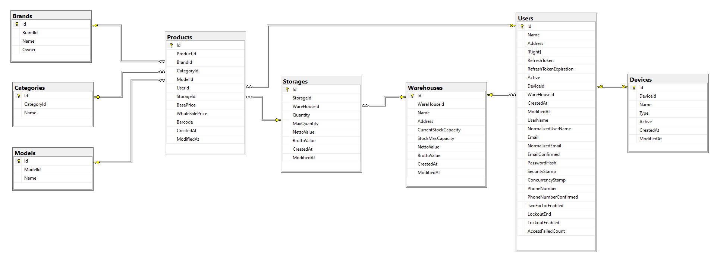

    

    <h1 style="border-bottom: 0">AudioShop Inventory Management</h1>
    <h3>Rest API (Backend)</h3>
    <h4>Portfólió munka</h4>
     

---

    <h3>A projekt leírása:</h3>

- Az AudioShopInventoryManagement mobil applikáció backend részét valósítja meg, ez a program fogja szolgáltatni az adatokat az alkalmazásunk számára.
- A program <b>Asp.NET (C#)</b> alapon lett elkészítve.

---

    <h3>A projekthez felhasznált, C# alapú fõbb osztályok, csomagok:</h3>

- Framework: .NET 8. Verzió
- Adatbázis kezelés: Entity Framework és Microsoft SQLServer
- JWT (JSON Web Token) kezelése: JwtBearer (Microsoft saját csomagja)
- API kérések és válaszok kezelése: Newtonsoft

---

     
    <h3>Az adatbázis felépítése</h3>

        
        
Az adatbázis táblái és az azok közti kapcsolatok

---

     
    <h3>A termék azonosítójának kezelése</h3>

- A termékek azonosítója a backend oldalon 3 külön rész szerint van kezelve:
    - Brand ID -> az adott eszköz márkájának a megnevezése
    - Category ID -> az adott termék kategóriája
    - Model ID -> az adott termék model megnevezése, száma
- A termék azonosítója egy példa termék esetén (Sennheiser HD 560S):
    - Ebben az esetben a <b>Sennheiser</b> lesz a márka
    - A <b>fejhallgató</b> kategóriába sorolható.
    - Model megnevézese (száma) pedig a <b>HD 560S</b> lesz.
- Az azonosító ilyen módon való kezelése megengedi azt a lehetõséget, hogy egyes márkájú, kategóriájú és modellû eszközöket meg tudjunk különböztetni egymástól.
- Ha például egy meglévõ modelbõl a gyártó késõbb létrehoz egy speciális változtatot, akkor azt könnyen tudjuk ezzel a módszerrel kezelni backend oldalon.
- A márka, kategória és model mindegyike rendelkezik egy egyedi azonosítóval, amelyekbõl a termék felvételekor létrehozzuk a termék fõazonosítóját.
- <b>Ez az azonosító nem összekeverendõ a vonalkóddal:</b>
    - A vonalkód <b>(adatbázisban Products tábla Barcode mezõ)</b> minden egyes terméket külön-külön, egyedileg azonosít <b>(nincs két ugyanolyan vonalkóddal rendelkezõ termék az adatbázisban).</b>
    - Ezzel szemben a termék azonosító <b>(adatbázisban Products tábla ProductsId mezõ)</b> a terméket létrehozó céget, kategória besorolását és a cég által a termék létrehozásakor meghatározott model nevét írja le <b>(az adatbázisban több elõfordulás lehetséges)</b>.
- <b>A valóságban eltérhet a termék azonsítójának kezelése.</b>
 

        </a>
        
A termék azonosítójának részei

